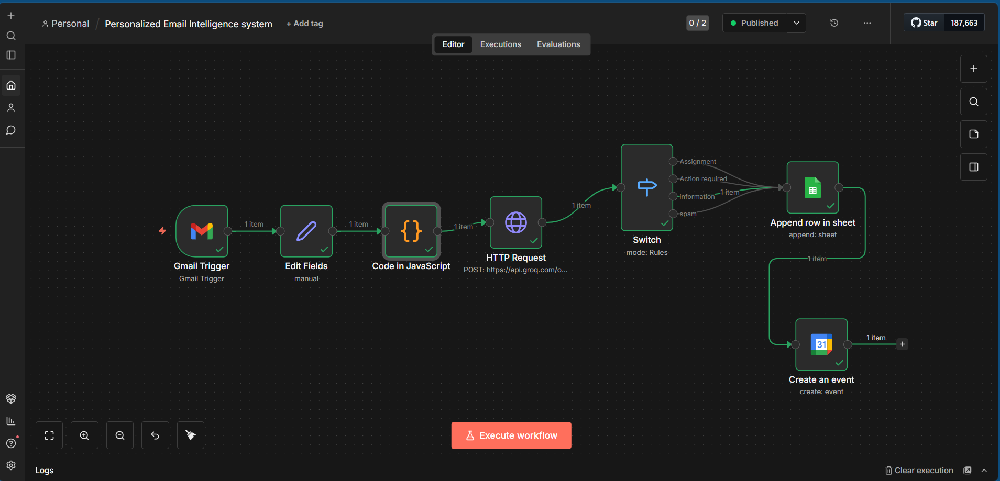

# My Personal AI Email Assistant 📧🤖

**Project Status:** Developed during my 1st Year of B.Tech (Engineering).

I built this **AI Automation tool** as a first-year engineering student to manage my own inbox more efficiently and summarize it and notifies me through the calendar. It is a locally hosted automation that runs on my operating system via n8n. 

I have added a visual picture of my actual n8n canvas  

## 🎯 What it does for me
This assistant processes my incoming emails to:
* **Summarize:** It reads the body of the received email and summarizes the content in maximum 3 lines.
* **Categorizes:** After summarizing it categorizes the data in several categories (**assignment, action required , information**)
* **Extract Deadlines:** It scans the text for any mentioned dates or deadlines so I don't miss them.
* **Assign Priority:** It automatically tags every email as **High**, **Medium**, or **Low** priority based on the urgency of the content.
* **Calender Notification:** It notifies the summarized email through the calender within a minute or two after the email is received.

## ⚙️ Technical Setup
* **Environment:** Locally hosted n8n (running via Terminal).
* **Execution:** The assistant only triggers when my local OS is active and the workflow is set to 'Published.'
* **Logic:** I used a custom **Code Node** to structure the AI's response and handle the categorization logic.
* **AI Model:** [llama-3.1-8b-instant].

## 🛠️ To access and use this workflow:
* **Download the File:** Save the `Personalized Email Intelligence System.json` from this repository to your computer.
* **Install n8n:** Ensure you have n8n installed and running locally via your terminal.
* **Import the Workflow:** Open your n8n dashboard, click the menu (three dots), and select **"Import from File"**.
* **Setup Credentials:** You must link your own Gmail/Outlook API credentials and your own AI (OpenAI/Gemini) API keys.
* **Activate:** Ensure the workflow is set to 'Published' and your terminal remains open for the automation to trigger.

---
*I am sharing this JSON file to document my learning progress and the logic behind the automation during my engineering studies.*
